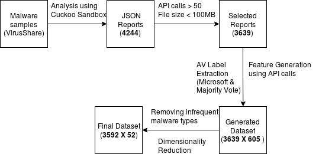
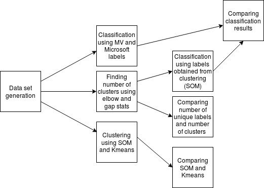

# Behavorial Analysis of Malware using Machine Learning

## About the project

With the recent increase in malicious attacks via ransomware and the losses incurred by various segments of the society, both in terms of data and money, the need of the hour is to find novel techniques to improve detection rates and performance. Current antivirus techniques rely on hash or signature comparisons via static analysis, which makes zero-day detection impossible. In order to cope with this many antivirus companies are now incorporating behavioral approaches.

In this project we have worked on how machine learning can be combined with behavioral analysis in order to cluster the malware samples into distinct similar-behavior families which can further facilitate a paradigm shift in detection techniques. Alongside proposing a behavioral profile based malware detection, we have also used machine learning to reveal inconsistencies associated with antivirus labels of malware.

We collected the samples from [VirusShare](https://virusshare.com/) and obtained their behavioral profiles by running them in [Cuckoo sandbox](https://www.cuckoosandbox.org/).

## Data Generation Module
The sequential steps which we followed for data generation are as follows:

## Behavioral Analysis Module
The workflow for behavioral analysis module is as follows:

#### The report for the project can be found [here](https://github.com/anushthakalia/Malware_analysis/blob/master/Project_report.pdf)
